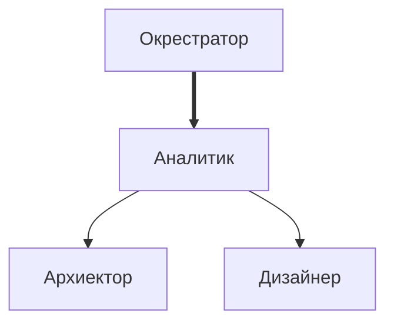
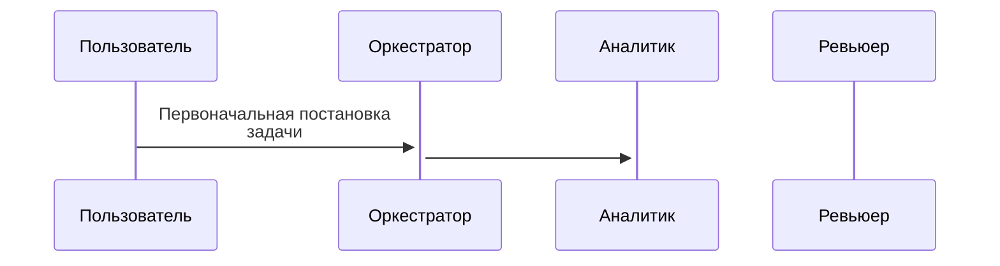

# Промпты агентов для мультиагентной разработки в Cursor.

## Команды агентов

### Дизайн

Команда дизайна занимается проектированием интерфейсов экранов

### Разработка

## Иерархия команды агентов


## Схемы взаимодействия

### 1. Этап планирования


Общее описание подхода: [00_agent_development.md](https://github.com/rdudov/agents/blob/master/00_agent_development.md)

Промпт оркестратора, который координирует работу остальных агентов: 01_orchestrator.md

Промпты агентов (названия говорят сами за себя):
- [02_analyst_prompt.md](https://github.com/rdudov/agents/blob/master/02_analyst_prompt.md)
- [03_tz_reviewer_prompt.md](https://github.com/rdudov/agents/blob/master/03_tz_reviewer_prompt.md)
- [04_architect_prompt.md](https://github.com/rdudov/agents/blob/master/04_architect_prompt.md)
- [05_architecture_reviewer_prompt.md](https://github.com/rdudov/agents/blob/master/05_architecture_reviewer_prompt.md)
- [06_agent_planner.md](https://github.com/rdudov/agents/blob/master/06_agent_planner.md)
- [07_agent_plan_reviewer.md](https://github.com/rdudov/agents/blob/master/07_agent_plan_reviewer.md)
- [08_agent_developer.md](https://github.com/rdudov/agents/blob/master/08_agent_developer.md)
- [09_agent_code_reviewer.md](https://github.com/rdudov/agents/blob/master/09_agent_code_reviewer.md)

Пример промпта для запуска мультиагентной разработки в Cursor, чтобы он автоматически стартовал субагентов с нужными ролями. 
```
Используя подход по оркестрации мультиагентной разработки (agents/01_orchestrator.md), 
выполни доработку {ссылка на файл с постановкой задачи}.

Описание проекта {ссылка на описание проекта для агентов, если проект существующий}

Каталог артефактов пайплайна: docs/implementation

Промпты агентов с указанными в 01_orchestrator.md ролями находятся в agents (02*.md..09.md).
Агентов нужно вызывать shell-командами:
agent -f --model {модель} -p {промпт}
и дожидаться от них результатов.

Промпт следующего формата:
"{содержимое файла с ролью} {входные данные согласно описанию роли}"

Модель:
аналитик, архитектор, планировщик — gpt-5.4-high
ревьюеры ТЗ, архитектуры, плана, кода и разработчик — gpt-5.3-codex
```

Необходимо установить CLI agent через curl https://cursor.com/install, запустить agent login и залогиниться с учёткой cursor.
Названия моделей для CLI можно уточнить командой agent models.

