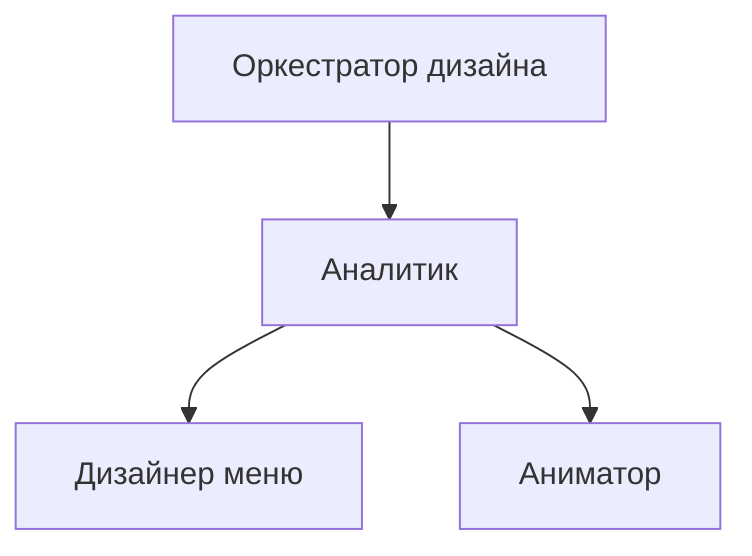

# Команда агентов для разработки дизайна UI

## Назначение

Команда проектирует UI для мини-экранов разных размеров и плотности пикселей, а также готовит пиксельные анимации для состояний интерфейса.

## Состав команды

1. `01_design_orchestrator.md` — оркестратор дизайна
2. `02_design_analyst.md` — аналитик-маршрутизатор
3. `03_menu_designer.md` — дизайнер меню
4. `04_pixel_animator.md` — аниматор пиксельной графики

## Иерархия



## Схема работы

1. Оркестратор принимает задачу пользователя.
2. Оркестратор передает задачу аналитику.
3. Аналитик решает, кого запускать:
   - только дизайнера меню;
   - только аниматора;
   - обоих последовательно или параллельно.
4. Исполнители создают артефакты дизайна и возвращают ссылки на файлы.
5. Оркестратор проверяет полноту, объединяет результат и возвращает итог пользователю.

## Рекомендуемые артефакты

- `design/ui_spec.md` — спецификация экранов, layout, компоненты
- `design/assets/menu/` — png/svg/aseprite/piskel исходники меню
- `design/assets/animations/` — наборы кадров и gif/apng preview
- `design/assets/animations/manifest.md` — карта анимаций (имя, размер, fps, цикличность)

## Пример запуска

```text
Используя `.agents/design/01_design_orchestrator.md`, разработай UI меню и анимации
для экранов 128x64, 160x80 и 240x135.

Артефакты сохраняй в `design/`.
Промпты ролей лежат в `.agents/design/`.
```
